# README – System Rezerwacji Hotelowych

Poniższy plik README opisuje projekt systemu rezerwacji hotelowych, który umożliwia zarządzanie gośćmi, rezerwacjami, pokojami, dodatkami, pracownikami i wieloma innymi elementami. Zawiera też wskazówki dotyczące uruchomienia aplikacji, konfiguracji, wdrożenia oraz propozycję miejsc, w których można dodać screenshoty ukazujące działanie systemu.

---
## Spis treści
1. [Opis projektu](#opis-projektu)
2. [Technologie i wymagania systemowe](#technologie-i-wymagania-systemowe)
3. [Struktura projektu](#struktura-projektu)
4. [Instalacja](#instalacja)
5. [Konfiguracja](#konfiguracja)
6. [Instrukcje uruchomienia](#instrukcje-uruchomienia)
7. [Główne funkcjonalności](#główne-funkcjonalności)
8. [Przykładowe screenshoty](#przykładowe-screenshoty)
9. [Architektura bazodanowa i logika](#architektura-bazodanowa-i-logika)
10. [Utrzymanie i rozwój projektu](#utrzymanie-i-rozwój-projektu)
11. [Autor](#autor)

---
## Opis projektu
**System Rezerwacji Hotelowych** to zaawansowana aplikacja umożliwiająca:
- Zarządzanie rezerwacjami
- Obsługę wyposażenia pokoi
- Zarządzanie pokojami i klasami pokojów
- Zarządzanie typami łóżek
- Dodawanie i edycję gości
- Dodawanie, edycję i usuwanie dodatków
- Zarządzanie pracownikami i rolami
- Generowanie różnego rodzaju raportów (m.in. finansowych, statystycznych)
- Logowanie zmian i operacji w bazie

Celem projektu jest automatyzacja czynności związanych z rezerwacjami, stanem pokoju, płatnościami, obsługą gości i zarządzaniem personelem.

---
## Technologie i wymagania systemowe
1. **Serwer bazodanowy**: PostgreSQL
2. **Języki**: PHP (backend), JavaScript (frontend), SQL (procedury, funkcje)
3. **Strona WWW**: HTML, CSS, JavaScript
4. **Biblioteki frontend**: Chart.js do wizualizacji raportów, jsPDF do eksportu PDF, XLSX do eksportu Excel
5. **Serwer**: Skonfigurowany serwer Apache (lub inny) z obsługą PHP
6. **Przeglądarka**: Nowoczesna przeglądarka wspierająca HTML5, JavaScript, CSS
7. **Inne**: 
   - php.ini z włączoną obsługą PDO do komunikacji z bazą danych
   - Uprawnienia do tworzenia schematów w PostgreSQL
   - **Względy bezpieczeństwa**: Hasła i klucze uwierzytelniające do bazy danych należy przechowywać poza repozytorium (lub w plikach, które nie są commitowane). Poniższy przykład w `config.php` jest jedynie poglądowy.

---
## Struktura projektu
Struktura plików (podział logiczny) wygląda następująco:

```
project-root/
├── pages/
│   ├── funkcjonalnosci/
│   ├── pracownicy/
│   ├── goscie/
│   ├── klasy_pokoi/
│   ├── typy_lozek/
│   ├── pokoje/
│   ├── raporty/
│   ├── rezerwacje/
│   ├── wyposazenie/
│   ├── dodatki/
│   └── logi_systemowe/
│
├── includes/
│   ├── header.php
│   └── footer.php
│
├── assets/
│   ├── css/
│   ├── images/
│   └── js/
│
├── config.php
├── index.php
├── test_connection.php
└── repo-sql/
```

1. **pages/** – zawiera podstrony i moduły aplikacji (funkcjonalnosci, pracownicy, goscie itd.).
2. **includes/** – zawiera pliki nagłówkowe (header) i stopki (footer) oraz ewentualne ustawienia sesji.
3. **assets/** – przechowuje pliki CSS, JS, obrazy, ikony, itp.
4. **config.php** – ustawienia i parametry bazy danych oraz URL projektu (uwaga: nie ujawniaj prawdziwych credentiali w repozytorium publicznym).
5. **index.php** – Strona główna projektu (może być stroną powitalną, wyborem języka lub przekierowaniem do logowania/dashbordu).
6. **test_connection.php** – Skrypt testujący połączenie z bazą.
7. **repo-sql/** – osobny folder na repozytorium SQL (np. `projekt.sql`).

---
## Instalacja
1. **Klonowanie repozytorium** (lub pobranie paczki ZIP z plikami):

```bash
git clone https://github.com/LeoTheOriginal/Hotel-Reservation-Database.git
```

2. **Utworzenie bazy danych** w PostgreSQL (np. `hotel_db`).
3. **Uruchomienie skryptu** SQL z katalogu `repo-sql/`:

```bash
psql -U postgres -d hotel_db -f projekt.sql
```

4. **Skonfigurowanie pliku** `config.php` z danymi dostępowymi do bazy:

```php
<?php
// /config.php

$host = "host_adres_bazy"; 
$dbname = "nazwa_bazy"; 
$user = "nazwa_uzytkownika"; 
$password = "haslo"; 
$base_url = '/~2piotrowski/hotel'; 
$schema = "rezerwacje_hotelowe"; 

// Definicje stałych dla ról
define('ROLE_ADMINISTRATOR', 'Administrator');
define('ROLE_MANAGER', 'Manager');
define('ROLE_RECEPCJONISTA', 'Recepcjonista');

// Ustawienia połączenia
$dsn = "pgsql:host=$host;port=5432;dbname=$dbname;user=$user;password=$password";

try {
    // Utworzenie nowego połączenia PDO
    $pdo = new PDO($dsn);
    $pdo->exec("SET NAMES 'UTF8'");
    // $pdo->exec("SET search_path TO $schema"); // ewentualnie

    // Włączenie obsługi błędów
    $pdo->setAttribute(PDO::ATTR_ERRMODE, PDO::ERRMODE_EXCEPTION);
} catch (PDOException $e) {
    // Obsługa błędów połączenia
    echo "Błąd połączenia z bazą danych: " . $e->getMessage();
    exit;
}

$test = $pdo->query("SELECT 1");
if (!$test) {
    echo json_encode(['success' => false, 'error' => 'Brak połączenia z bazą danych.']);
    exit;
}
?>
```

> **Uwaga**: Upewnij się, że nie umieszczasz w repozytorium prawdziwych haseł i kluczy!

---
## Konfiguracja
1. W pliku `config.php` ustaw:
   - **$host**, **$dbname**, **$user**, **$password** – adekwatnie do Twojej bazy PostgreSQL.
   - **$base_url** – URL projektu (np. http://localhost/hotel lub /~nazwa_urzytkownika/hotel).
   - **$schema** – Nazwa schematu w bazie (domyślnie `rezerwacje_hotelowe`).
2. Sprawdź, czy folder `assets/images/uploads` ma odpowiednie uprawnienia (zapisywalny dla PHP) – jeśli korzystasz z uploadu zdjęć.
3. Upewnij się, że `php.ini` ma włączone rozszerzenie pdo_pgsql.
4. Po wypełnieniu tych informacji możesz uruchomić projekt.

---
## Instrukcje uruchomienia
1. Skonfiguruj wirtualny host lub używaj `http://localhost/hotel` (zależnie od Twojego środowiska).
2. Otwórz w przeglądarce główną stronę – `index.php`. Może ona pełnić funkcję strony powitalnej lub przekierowywać do logowania.
3. Zaloguj się na konto (jeśli już istnieje konto Administratora) lub dodaj nowe konto dla pracownika (z poziomu dostępu Managera lub Administratora).
4. Po zalogowaniu użytkownik trafia na **Dashboard** (dashboard.php) – sekcję, w której może:
   - Przeglądać swoje podstawowe dane i ewentualnie zmienić login bądź hasło,
   - Załadować zdjęcie profilowe,
   - Zobaczyć podstawowe statystyki lub odnośniki do dalszych modułów.
5. Z panelu nawigacyjnego dostępne będą poszczególne moduły:
   - **Rezerwacje**
   - **Pokoje**
   - **Goście**
   - **Pracownicy**
   - **Raporty** (finansowe, statystyczne)
   - **Typy łóżek**
   - **Wyposażenie**
   - **Dodatki**
   - **Funkcjonalności** (opisowe – tutaj znajdzie się bardziej szczegółowy opis działania strony)
   - **Logi systemowe**
6. Dostępność poszczególnych funkcji zależy od roli zalogowanego użytkownika (Administrator, Recepcjonista, Manager).

---
## Główne funkcjonalności
1. **Strona główna (index.php)**
   - Może prezentować krótki opis hotelu lub przekierowywać do panelu logowania.
   - Często zawiera odnośniki do modułu publicznych rezerwacji.

2. **Dashboard (dashboard.php)**
   - Zawiera informacje o zalogowanym pracowniku (imię, nazwisko, login, rola), możliwość zmiany loginu/hasła.
   - Obsługuje upload zdjęcia profilowego.
   - Prezentuje skróty do głównych sekcji systemu.

3. **Zarządzanie rezerwacjami** (pages/rezerwacje)
   - Dodawanie rezerwacji (dla nowego lub istniejącego gościa)
   - Edycja rezerwacji (np. zmiana dat, dodawanie/ usuwanie dodatków)
   - Usuwanie i anulowanie rezerwacji
   - Wykwaterowanie (zmiana statusu pokoju na „Dostępny” oraz statusu płatności na „Zrealizowana”)

4. **Goście** (pages/goscie)
   - Dodawanie nowego gościa, weryfikacja unikalności email
   - Edycja danych gościa
   - Usuwanie gościa (tylko przez Administratora/Managera)

5. **Pokoje** (pages/pokoje)
   - Definiowanie klasy pokoju, piętra, statusu
   - Automatyczne obliczanie liczby osób w zależności od łóżek i klasy pokoju

6. **Dodatki** (pages/dodatki)
   - Definiowanie dodatków, np. Śniadanie, Parking, SPA
   - Możliwość przypisywania dodatków do rezerwacji

7. **Raporty** (pages/raporty)
   - Raporty finansowe (Chart.js): przychody w określonych miesiącach
   - Raporty dotyczące pokoi (obłożenie)
   - Raporty dotyczące gości (liczba rezerwacji na gościa)
   - Eksport wyników do CSV, Excel, PDF

8. **Logi systemowe** (pages/logi_systemowe)
   - Zapis szczegółów w formacie JSONB w bazie
   - Przeglądanie, usuwanie lub wyczyszczenie logów

9. **Pracownicy** (pages/pracownicy)
   - Dodawanie i edycja danych pracownika
   - Przypisywanie roli (Administrator, Recepcjonista, Manager)
   - Zmiana hasła i logina

10. **Wyposażenie** (pages/wyposazenie)
   - Dodawanie/ edycja/ usuwanie wyposażenia (np. Telewizor, Wi-Fi, Klimatyzacja)

11. **Typy łóżek** (pages/typy_lozek)
   - Definiowanie i usuwanie typów łóżek (np. Pojedyncze, Podwójne, Królewskie)

12. **Publiczna strona rezerwacji**
   - Możliwość dokonania rezerwacji przez gościa, wybór klasy pokoju, dodatków itp.
   - Automatycznie sprawdzana dostępność pokoi, obliczany koszt itd.

13. **Funkcjonalności** (pages/funkcjonalnosci)
   - Dodatkowe opisy poszczególnych elementów systemu (moduł informacyjny)

---
## Przykładowe screenshoty

Aby lepiej zobrazować poszczególne widoki i funkcjonalności systemu, poniżej znajduje się zbiór przykładowych zrzutów ekranu wraz z krótkim opisem.

---

### 1. Strona Główna (index.php)
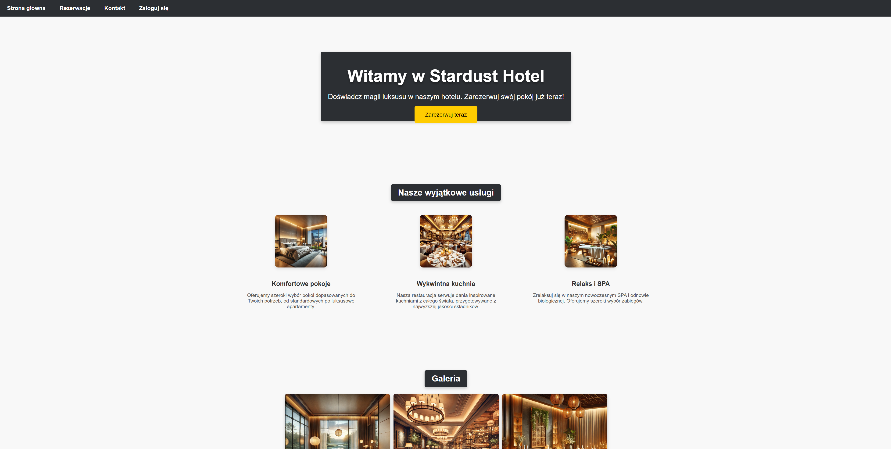  
*Rys. 1. Ekran powitalny z odnośnikiem do logowania oraz/lub strony publicznej rezerwacji.*

---

### 2. Ekran Logowania
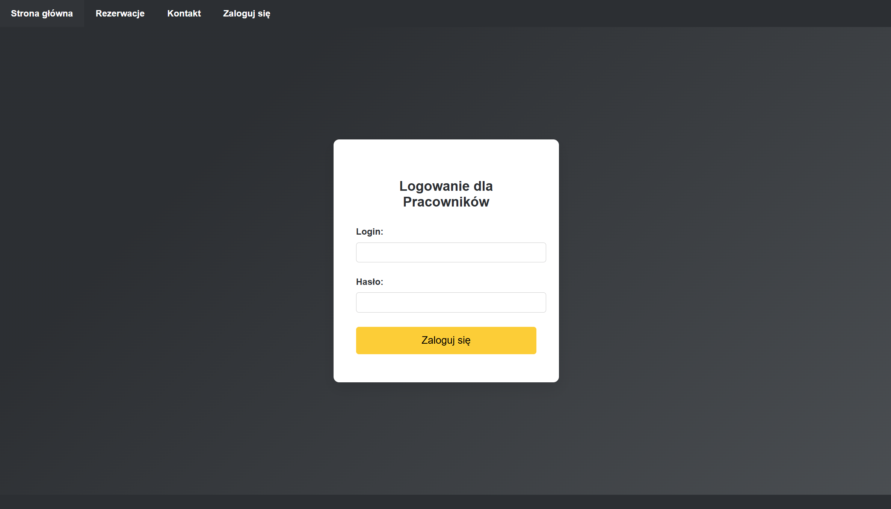  
*Rys. 2. Formularz logowania do systemu.*

---

### 3. Dashboard (dashboard.php)
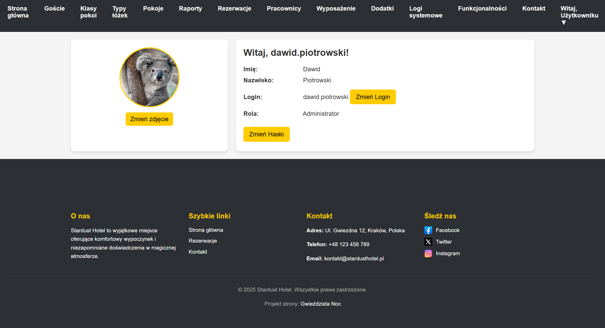  
*Rys. 3. Panel informacyjny dla zalogowanego pracownika: zmiana loginu, hasła, zdjęcia profilowego, a także skróty do głównych sekcji.*

---

### 4. Rezerwacje (pages/rezerwacje)
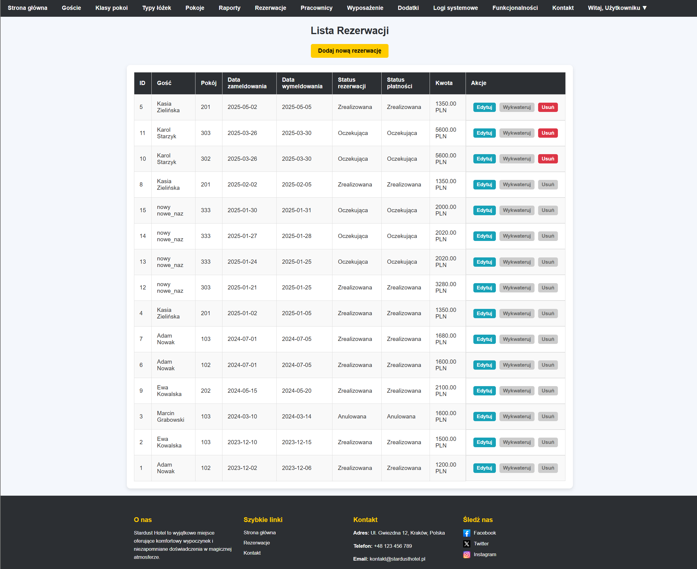  
*Rys. 4. Lista rezerwacji z opcją dodawania nowej, edycji i eksportu do PDF/CSV/Excel.*

---

### 5. Goście (pages/goscie)
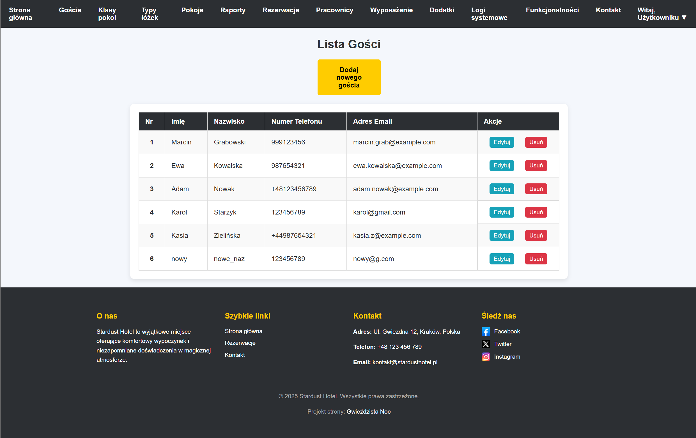  
*Rys. 5. Wykaz gości z przyciskiem „Dodaj Gościa” i możliwością edycji/usuwania danych.*

---

### 6. Pracownicy (pages/pracownicy)
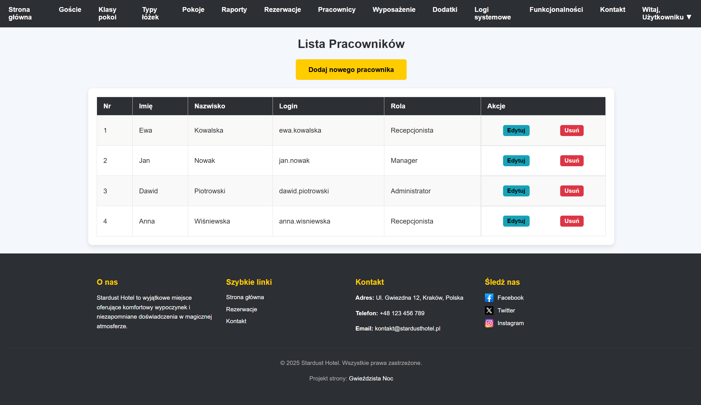  
*Rys. 6. Zarządzanie pracownikami: dodawanie, edycja, przypisywanie ról (Administrator, Recepcjonista, Manager).*

---

### 7. Raporty (pages/raporty)
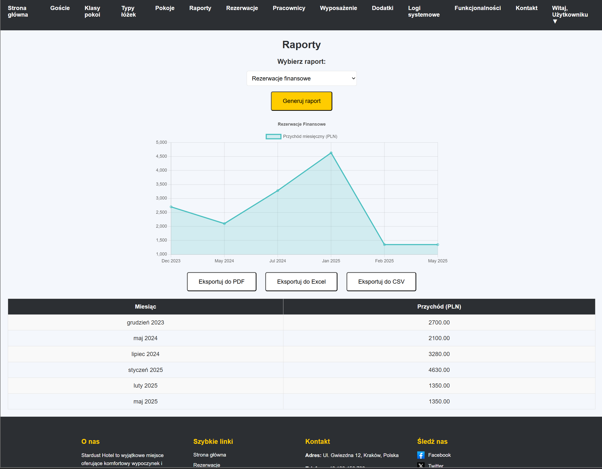  
*Rys. 7. Raporty z wykorzystaniem wykresów (Chart.js) oraz możliwość eksportu w różnych formatach.*

---

### 8. Wyposażenie (pages/wyposazenie)
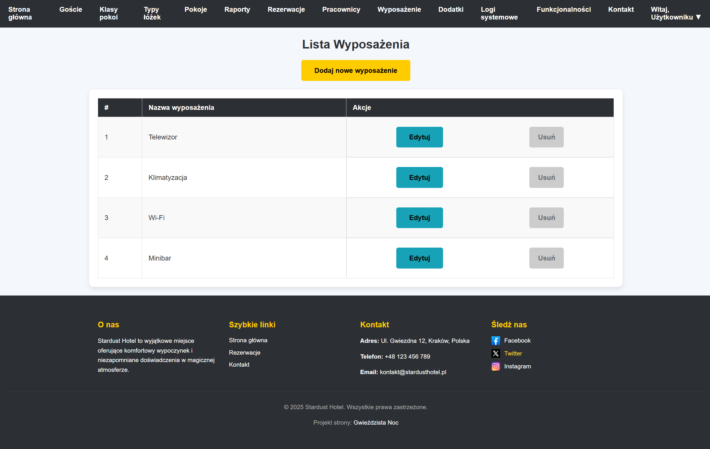  
*Rys. 8. Lista dostępnego wyposażenia i narzędzia do dodawania/edycji.*

---

### 9. Typy Łóżek (pages/typy_lozek)
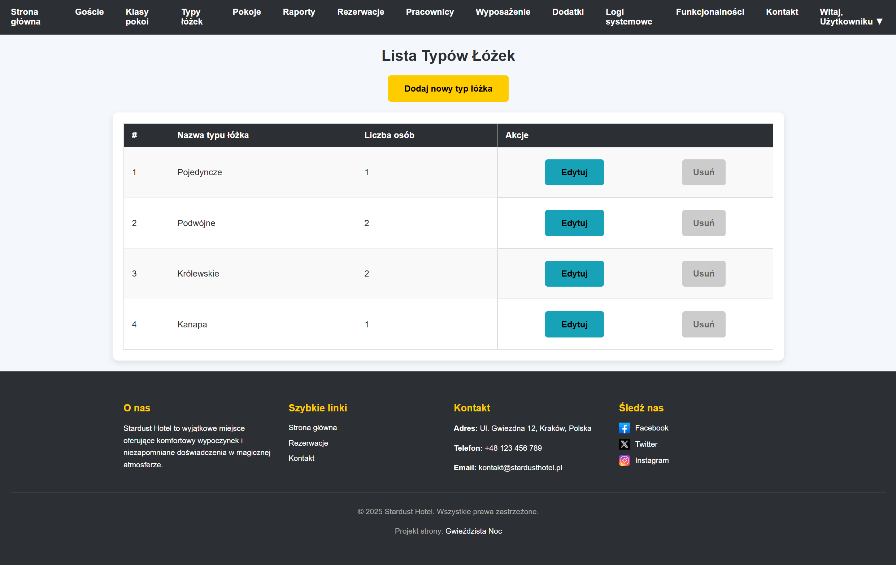  
*Rys. 9. Spis zdefiniowanych łóżek (pojedyncze, podwójne, kanapa itd.) i możliwość dodania nowych.*

---

### 10. Dodatki (pages/dodatki)
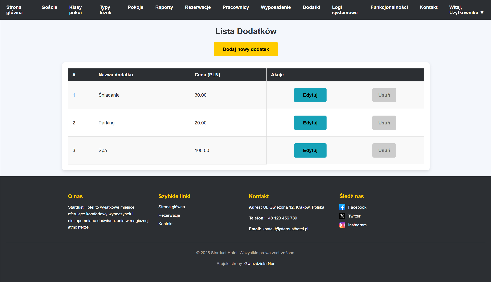  
*Rys. 10. Lista dostępnych dodatków do rezerwacji (śniadanie, parking, spa), edycja i usuwanie.*

---

### 11. Funkcjonalności (pages/funkcjonalnosci)
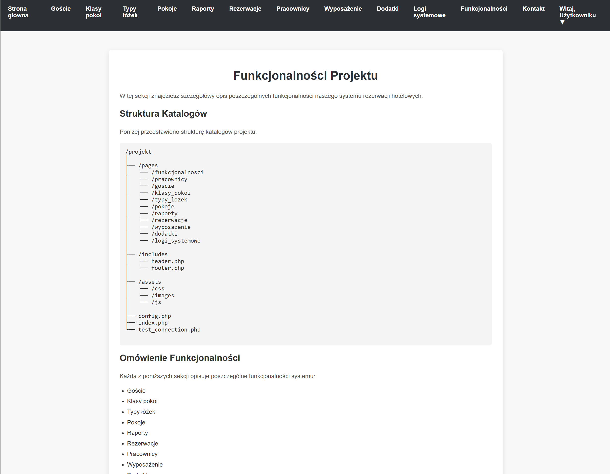  
*Rys. 11. Sekcja opisowa dokumentująca kolejne moduły i ich zastosowanie.*

---

### 12. Logi systemowe (pages/logi_systemowe)
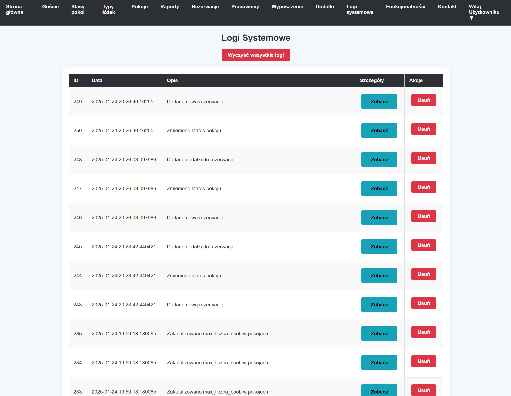  
*Rys. 12. Szczegóły operacji w formacie JSONB, możliwość wglądu i czyszczenia logów.*

---
## Architektura bazodanowa i logika
1. **Baza danych**: PostgreSQL z rozbudowanymi funkcjami, triggerami i widokami.
2. **Warstwa logiki**: 
   - Funkcje w PL/pgSQL obsługują kluczowe procesy (dodawanie rezerwacji, obliczanie kosztów, przydział pokoi, wykwaterowanie, anulowanie). 
   - Triggery dbają o zmianę statusu pokoju, wypełnianie kolumn `max_liczba_osob` i logowanie wydarzeń.
3. **Walidacja**: Rozbudowane constraints, np. 
   - unikalność w `gość(adres_email)` i `pracownik(login)`,
   - check constraints na liczbę osób, kwotę rezerwacji, telefon itp.
4. **Zarządzanie stanem aplikacji**:
   - Szerokie wykorzystanie sesji PHP (np. przechowywanie danych zalogowanego użytkownika),
   - Weryfikacja roli użytkownika przy odwoływaniu się do endpointów.
5. **Możliwość eksportu**:
   - Raporty można eksportować do PDF (jspdf), CSV, Excel (SheetJS).

---
## Utrzymanie i rozwój projektu
1. **Logi systemowe** – zawierają historię operacji. Można je wyczyścić, ale należy pamiętać o ewentualnych kopiach bezpieczeństwa.
2. **Backup bazy** – rekomendowane korzystanie z `pg_dump` (PostgreSQL) do cyklicznego backupu.
3. **Rozbudowa** – w przyszłości można dodać:
   - Moduł powiadomień mailowych
   - Integrację z zewnętrznymi serwisami płatności
   - Zaawansowane moduły raportowania z parametrami czasowymi
   - Integrację z systemami do zarządzania personelem
4. **Zabezpieczenia** – wprowadzić szyfrowanie połączeń, dodać logowanie zdarzeń bezpieczeństwa, rozbudować walidacje i mechanizmy autoryzacji.

---
## Autor
**Imię i nazwisko**: Piotrowski Dawid  
**Kierunek**: Informatyka Stosowana, AGH  
**Data ukończenia**: 15.01.2025r.  

Projekt powstał w ramach zajęć i ma na celu zaprezentowanie umiejętności w zakresie projektowania i implementacji bazy danych (PostgreSQL), tworzenia funkcjonalnych interfejsów w PHP, JavaScript, a także zarządzania złożonymi procesami rezerwacyjnymi.

